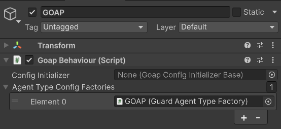
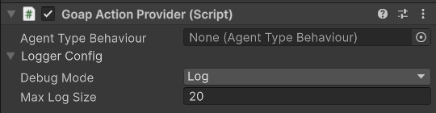
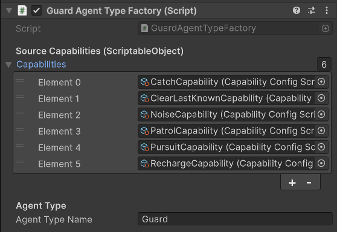
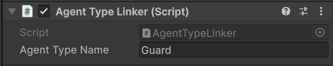

# GOAP Architecture and Script Guide

This document explains how the project’s GOAP (Goal-Oriented Action Planning) layer is structured, what each script does, and how they interact at runtime. 
It serves as a reference for understanding, extending, or modifying the AI behaviour system.

The system is built on [CrashKonijn GOAP (v3)](https://github.com/crashkonijn/GOAP) 
package and ties into Unity’s NavMesh.

The museum guards are the GOAP agents that plan between the different goals:
* **PatrolGoal**: Patrolling the museum
* **InvestigateNoiseGoal**: Investigating noises
* **PursuitGoal**: Pursuing the player
* **CatchGoal**: Catching the player
* **ClearLastKnownGoal**: Clearing the players last-known position
* **RechargeGoal**: Recharging the flashlight when energy reaches 0

## GOAP Runtime Flow

- **GoapBehaviour** is located on an EmptyGameObject (the global GOAP host). \
This Game object holds the GOAP Behaviour and the agent type factory with all the capability configurations. \
 

  
- Each **Guard** agent GameObject has a **GoapActionProvider**. It exposes what actions/goals/sensors that agent can use. \

- **GuardAgentTypeFactory** (on the GoapBehaviour object) builds the “Guard” AgentType from capability ScriptableObjects, and performs some deduplication and tunable cost tweaks. \
 

- **AgentTypeLinker** (on each guard) links that guard’s GoapActionProvider to the built AgentType (named "Guard"). \

- **BrainBehaviour** *and other behaviour scripts* (on each guard) owns state like whether the player was seen/caught, last-known player position, heard noises, and exposes helper APIs. \
Some of these settings can be changed directly in the inspector. \
It also registers the agent’s goals on Start(). \

- **Sensors** read data from components (BrainBehaviour, SimpleGuardSightNiko, EnergyBehaviour, NavMeshAgent, scene tags, etc.) and write world/target keys the planner uses.

- **Actions** (Patrol, Pursuit, Catch, InvestigateNoise, ClearLastKnown, Recharge) drive the agent via NavMeshAgent or transform movement, read sensor-provided targets, and update behaviours/state.

## Configuration scripts

### `Config/GuardAgentTypeFactory.cs`
Builds a complete **AgentType** (actions, goals, sensors) for guards from a list of capability ScriptableObjects; performs deduplication and optional cost tweaks.

**Highlights**:
- **Serialized fields:**
  - capabilities: list of CapabilityConfigScriptable assets. Each provides portions of the GOAP graph (goals/actions/sensors). The factory merges them.
  - agentTypeName: defaults to "Guard". The AgentType is registered under this name.
  - investigateNoiseCostMultiplier, pursuitCostMultiplier: simple cost multipliers applied programmatically by matching action class names.

- **Create():**
  - Builds ICapabilityConfig for each capability.
  - Merges Goals, Actions, WorldSensors, TargetSensors, MultiSensors into an AgentTypeConfig.
  - DeduplicateSensors(): groups by key name for world and target sensors and keeps the first instance.
  - Ensures there’s always an AtPlayerTarget world sensor (used by pursuit/catch flows).
  - ApplyDifficultyTweaks(): multiplies ActionConfig.BaseCost for InvestigateNoiseAction and PursuitAction if present.

- **OnValidate():** warns if the factory is on the same GameObject as GoapActionProvider; it should live on the GoapBehaviour object and be added to “Agent Type Config Factories”.

**How it fits:**
- GoapBehaviour queries this factory to get the AgentType. AgentTypeLinker will then bind each guard’s provider to that AgentType by name.

### `Config/AgentTypeLinker.cs`
Purpose: On each guard, link its GoapActionProvider to the AgentType created in GoapBehaviour.

Highlights:
- Looks up the GoapBehaviour in Awake/Start.
- Calls goap.GetAgentType(agentTypeName) and assigns provider.AgentType.
- Logs helpful errors if the AgentType isn’t found (e.g., factory not set up or name mismatch).

**How it fits:**
- Without this, planners/graph viewers won’t know which graph the agent uses; actions/goals won’t be active.

## Behaviour scripts (stateful components used by actions and sensors)

### `Behaviours/BrainBehaviour.cs`
Guard "brain"—holds runtime state for sight and hearing, last-known player position, and caught status. Helps actions coordinate.

**What it tracks**:
- **IsPlayerCaught**: true once the player gets caught.
- **Hearing**
  - HasHeardDistractionNoise, LastDistractionNoisePosition, lastDistractionNoiseTime.
  - HasHeardPlayerNoise, LastPlayerNoisePosition, LastHeardNoiseRadius, lastPlayerNoiseTime.
  - hearPlayerThroughWalls flag and hearingObstructionMask for occlusion when false.
  - audiblePursuitMemory: small memory window for optional proximity logic.
- **Vision**
  - Uses SimpleGuardSightNiko.CanSeePlayer(). If you can’t see the player this frame but you saw them last frame, it starts a “follow window”.
- **Last-known player position & follow window**
  - HasLastKnownPosition, LastKnownPlayerPosition.
  - When the guard loses sight, it opens a follow window for lastKnownChaseDuration seconds, refreshing the last-known position to the player’s current transform at lastKnownUpdateInterval. After the window ends, the position is frozen for investigation.
- **Head-turn to player noise**
  - If the player made a noise recently, and the guard doesn’t see the player, the guard will rotate towards the noise for lookAtPlayerNoiseDuration using lookTurnSpeed.
- **NavMesh Agent tuning:** angularSpeed and acceleration set in Awake.

**APIs used elsewhere:**
- SetPlayerCaught(bool)
- ClearLastKnownPlayerPosition()
- OnDistractionNoiseHeard(Vector3, radius)
- OnPlayerNoiseHeard(Vector3, radius): optionally checks occlusion.
- ClearDistractionNoise() / ClearPlayerNoise()
- IsWithinAudiblePursuitWindow(Transform)
- Static ActiveBrains set: GetActiveBrains() for broadcasting events like noises to all guards.

**Also**: On Start(), it registers the core goals via provider.RequestGoal(): PatrolGoal, PursuitGoal, CatchGoal, ClearLastKnownGoal, RechargeGoal, InvestigateNoiseGoal.

### `Behaviours/EnergyBehaviour.cs`
Simple energy model for guards.

- **currentEnergy** drains by **drainRate** over time, or recharges by **rechargeRate** when **isRecharging** is true.
- **SetRecharging**(bool) flips the state (used by **RechargeAction**).
- **Sensors** read **CurrentEnergy** to drive the **RechargeGoal**.

### `Behaviours/PatrolRouteBehaviour.cs`
Minimal waypoint provider for patrolling.

- On **Awake**, collects all GameObjects with tag "_Waypoint_" into an array.
- **GetCurrent()**: returns the current waypoint transform.
- **Advance()**: cycles to the next waypoint (wrap-around).

**Notes:**
- This uses scene-wide **FindGameObjectsWithTag**, so ordering depends on scene ordering. \
_If we need deterministic routes, consider a parent object holding ordered children_.

### `Behaviours/AgentMoveBehaviour.cs`
Example/simplified mover that listens to **AgentBehaviour** events and moves directly via transform towards the current target (Vector3.MoveTowards). \
_This is separate from the NavMesh-based actions_.

- Listens to **AgentBehaviour.Events** for target range/changes and toggles **shouldMove**.
- If **shouldMove** and a current target exist, moves every Update along XZ plane.
- Draws a gizmo line to the target.

Notes:
- Pursuit/Patrol/Recharge actions in this project use **NavMeshAgent**.

## Actions (what an agent does)

All actions derive from **GoapActionBase<TData>** and drive the guard using **NavMeshAgent** or transform. \
Each action exposes a Data class implementing **IActionData** that carries its **ITarget**.

### `Actions/PatrolAction.cs`
- **Target**: from **PatrolTargetSensor** (PositionTarget to current waypoint).
- **Start()**: acquires **NavMeshAgent** and sets destination to the waypoint.
- **Perform()**: completes when **agent.remainingDistance <= stoppingDistance**.
- **End()**: calls **PatrolRouteBehaviour.Advance()** to move to the next waypoint.

### `Actions/PursuitAction.cs`
- **Target**: from PlayerTargetSensor (TransformTarget when the player is visible).
- **Requires sight**: if SimpleGuardSightNiko.CanSeePlayer() is false, the action stops (planning will swap to ClearLastKnownGoal).
- **Movement**: sets destination to the player target.

- **Catch logic:**
  - If distance <= catchDistance (stoppingDistance + margin, min 1.5m), immediately “catches” by setting BrainBehaviour.IsPlayerCaught = true and completes.
  - Otherwise, if within CLOSE_RANGE_DISTANCE (5m) for CLOSE_RANGE_CATCH_TIME (5s), also catches via timer accumulation with decay when far.

**Effect in graph:** Drives the agent while the player is in sight; produces PlayerCaught state when catch conditions are met (read by PlayerCaughtSensor/goal graph).

### `Actions/CatchAction.cs`
- A short catch sequence with a 2s timer. \
Stops the NavMeshAgent, logs progress, and completes when done. \
Stub for playing animation/SFX/UI.

**Effect in graph:** Can be used to model a “catch” step after pursuit if your graph includes it.

### `Actions/ClearLastKnownAction.cs`
Go to the last-known player position (frozen after the follow window) and scan the area before satisfying goal.

- **Dependencies**: NavMeshAgent, SimpleGuardSightNiko (for eyes transform), BrainBehaviour.
- Reads scan tunables from BrainBehaviour if present: scanDuration, scanAngle, scanSweepTime, arriveDistance.
- **Start()**: sets destination to the last-known position (data.Target), stores a LookTransform (eyes if available) and base local Euler angles.

- **Perform()**:
  - If the player becomes visible again, returns Stop (planner will reselect pursuit).
  - During BrainBehaviour’s follow window (still updating last-known), it keeps following the moving last-known position and never scans yet.
  - After the follow window ends and the agent arrives at the frozen position, it stops and runs an oscillating yaw scan using a sine wave around BaseYaw or LookTransform.localEulerAngles.y for ClearDuration.
  - On completion, calls brain.ClearLastKnownPlayerPosition() and returns Completed.

- **End():** Restores agent rotation updates and the LookTransform’s localEulerAngles to their base, resets timers.

**Effect in graph:** Satisfies “HasLastKnownPosition” resolution by clearing it after scanning, returning the guard to normal duties.

### `Actions/InvestigateNoiseAction.cs`
Investigate distraction noises (e.g., thrown objects).

- **Target**: from NoiseTargetSensor (PositionTarget at BrainBehaviour.LastDistractionNoisePosition).
- **Start()**: sets NavMesh destination; resets timer.

- **Perform()**:
  - Moves to target; when arrived, stops and waits/investigates for INVESTIGATION_DURATION (3s).
  - On completion, calls brain.ClearDistractionNoise() to reset noise state.

**Effect in graph:** Addresses world key HeardNoise; returns the agent to patrol when done.

### `Actions/InvestigatePlayerNoiseAction.cs` 
- Currently does nothing.
- Created for possible future use instead of BrainBeheviour hearing (explicit “player noise” vs. “distraction noise”).

### `Actions/RechargeAction.cs`
Move to the recharge station and refill energy to maximum.

- **Target**: from RechargeTargetSensor (PositionTarget at a GameObject tagged "Breakpoint"; snapped to NavMesh).
- **Start()**: sets destination and begins moving.

- **Perform()**:
  - First reach the station and stop; then set EnergyBehaviour.SetRecharging(true).
  - Continue until CurrentEnergy >= MaxEnergy - tiny tolerance, then completes.

- **End()**: clears recharging state and resumes movement.

**Effect in graph:** Satisfies low-energy conditions and keeps Energy world state high.

## Sensors (produce world/target keys for planning)

World sensors set/measure values for WorldKeys; target sensors produce ITarget values for TargetKeys. \
All sensors derive from LocalWorldSensorBase or LocalTargetSensorBase and run per-agent.

### World sensors

- `Sensors/CanSeePlayerSensor.cs`
  - Uses SimpleGuardSightNiko.CanSeePlayer() to return 1/0 for the world key CanSeePlayer.

- `Sensors/AlertSensor.cs`
  - Returns 1 if the player is visible OR if BrainBehaviour.HasLastKnownPosition is true, else 0. Used for high-level alert state (IsAlert).

- `Sensors/HasLastKnownPositionSensor.cs`
  - Reads BrainBehaviour.HasLastKnownPosition and returns 1/0.

- `Sensors/AtRechargeStationSensor.cs`
  - Finds the “Breakpoint” object, snaps its position to NavMesh once, and returns 1 when the agent is within a threshold distance (3m by default).

- `Sensors/EnergySensor.cs`
  - Returns CurrentEnergy (rounded to int) as the world key Energy.

- `Sensors/HeardNoiseSensor.cs`
  - Returns 1 if BrainBehaviour.HasHeardDistractionNoise is true, else 0.

- `Sensors/PlayerCaughtSensor.cs`
  - Returns 1 if BrainBehaviour.IsPlayerCaught is true.

- `Sensors/AtPlayerTargetSensor.cs`
  - Computes distance between agent and player; returns 1 if within catch distance (~stoppingDistance + 0.5, min 1.5m).

### Target sensors

- `Sensors/PlayerTargetSensor.cs`
  - When the player is visible (SimpleGuardSightNiko.CanSeePlayer()), returns a TransformTarget pointing to the player (for PlayerTarget key).

- `Sensors/PatrolTargetSensor.cs`
  - Reads PatrolRouteBehaviour.GetCurrent() and returns a PositionTarget at the waypoint (for PatrolTarget key).

- `Sensors/RechargeTargetSensor.cs`
  - Finds the “Breakpoint” object, snaps to NavMesh, and returns a PositionTarget (for RechargeTarget key).

- `Sensors/NoiseTargetSensor.cs` (file name typo NosieTargetSensor.cs)
  - If BrainBehaviour.HasHeardDistractionNoise is true, returns a PositionTarget at LastDistractionNoisePosition (NavMesh-snapped).

- `Sensors/LastKnownPlayerTargetSensor.cs`
  - If BrainBehaviour.HasLastKnownPosition is true, returns a PositionTarget at LastKnownPlayerPosition. ClearLastKnownAction also updates this target during the follow window so tools like the Graph Viewer reflect the moving target.

## World keys and target keys

These are identifiers for the planner. The class name is the key; sensors set their values and actions/goals refer to them in the configuration (via capabilities).

World keys (all derive from WorldKeyBase):
- `WorldKeys/CanSeePlayer`
- `WorldKeys/IsAlert`
- `WorldKeys/HasLastKnownPosition`
- `WorldKeys/HeardNoise`
- `WorldKeys/AtRechargeStation`
- `WorldKeys/AtPlayerTarget`
- `WorldKeys/AtPatrolTarget`
- `WorldKeys/AtNoiseSource`
- `WorldKeys/Energy`
- `WorldKeys/PatrolCount`
- `WorldKeys/PlayerCaught`

Target keys (all derive from TargetKeyBase):
- `TargetKeys/PlayerTarget`
- `TargetKeys/PatrolTarget`
- `TargetKeys/RechargeTarget`
- `TargetKeys/NoiseTarget`
- `TargetKeys/LastKnownPlayerTarget`

## Goals

Goals are simple markers (derive from GoalBase) and are made available by BrainBehaviour.RequestGoal(...) and/or by the capabilities assembled in GuardAgentTypeFactory.

- `Goals/PatrolGoal`
- `Goals/PursuitGoal`
- `Goals/CatchGoal`
- `Goals/ClearLastKnownGoal`
- `Goals/RechargeGoal`
- `Goals/InvestigateNoiseGoal`
- `Goals/InvestigatePlayerNoiseGoal` (does nothing yet)

The actual conditions/desires (e.g., “Energy low”, “HeardNoise == true”, “HasLastKnownPosition == true”, etc.) are configured in the capability assets that feed into GuardAgentTypeFactory. Those assets live under Assets/Scripts/GOAP/Capabilities (ScriptableObjects not detailed here).

## How the pieces work together

**1) Vision/pursuit pipeline**
- SimpleGuardSightNiko determines visibility.
- CanSeePlayerSensor sets CanSeePlayer.
- PlayerTargetSensor provides PlayerTarget when visible.
- Planner selects PursuitAction for PursuitGoal. PursuitAction drives NavMeshAgent toward the PlayerTarget.
- If close enough or within close range long enough, PursuitAction sets BrainBehaviour.IsPlayerCaught = true. PlayerCaughtSensor updates the world key accordingly.
- If the player is lost, BrainBehaviour starts a short follow window updating LastKnownPlayerPosition; after it ends, the position freezes.
- LastKnownPlayerTargetSensor provides that frozen target; ClearLastKnownGoal plans into ClearLastKnownAction.
- ClearLastKnownAction moves to the frozen point, scans, then brain.ClearLastKnownPlayerPosition() to reset state.

**2) Hearing/noise pipeline**
- Some external gameplay event calls BrainBehaviour.OnDistractionNoiseHeard or OnPlayerNoiseHeard (you can broadcast to BrainBehaviour.GetActiveBrains()).
- HeardNoiseSensor returns true; NoiseTargetSensor returns a PositionTarget.
- InvestigateNoiseGoal selects InvestigateNoiseAction, which moves, waits a few seconds, and calls brain.ClearDistractionNoise().
- BrainBehaviour also briefly turns the head toward recent player noise to sell awareness.

**3) Energy/recharge pipeline**
- EnergyBehaviour drains over time.
- EnergySensor returns a numerical Energy world state.
- When below your capability-graph threshold, RechargeGoal is selected; RechargeTargetSensor returns the station target (tag "Breakpoint").
- RechargeAction moves, enables recharging, waits until full, then ends.

**4) Configuration wiring**
- GuardAgentTypeFactory aggregates capabilities into a single AgentType named “Guard”.
- AgentTypeLinker on each guard binds its GoapActionProvider to that AgentType by name.
- BrainBehaviour requests the goals so the planner can consider them.

## Setup checklist (per scene)

- **Global GOAP host:**
  - Add a GameObject with GoapBehaviour.
  - Add GuardAgentTypeFactory to the same object and add it to GoapBehaviour’s “Agent Type Config Factories”.
  - Ensure its agentTypeName matches the guard AgentTypeLinker (default "Guard").
  - Add your capability ScriptableObjects to the factory.

- **Guard prefab / agent:**
  - Components: NavMeshAgent, AgentBehaviour, GoapActionProvider, BrainBehaviour, EnergyBehaviour, SimpleGuardSightNiko.
  - Add AgentTypeLinker (agentTypeName = "Guard").
  - Optional: AgentMoveBehaviour (if not using NavMesh-driven actions).
  - Ensure the object is on an area baked by NavMesh.

- **Scene objects:**
  - Player tagged "Player".
  - Waypoints tagged "Waypoint" for patrol.
  - Recharge station object tagged "Breakpoint" (_the code will snap to NavMesh for precise targeting_).

## Edge cases and safeguards

- **NavMesh availability:** Most actions check navAgent != null, enabled, and isOnNavMesh. Without NavMesh, they Stop to avoid errors.

- **Missing components:** Sensors and actions log warnings and degrade gracefully if dependencies are missing (e.g., SimpleGuardSightNiko, EnergyBehaviour, PatrolRouteBehaviour).

- **Sensor duplicates:** GuardAgentTypeFactory DeduplicateSensors() prevents multiple sensors writing the same key.

- **Last-known follow window:** ClearLastKnownAction defers scanning until the follow window ends and keeps updating both the NavMesh destination and the GOAP PositionTarget.

- **Hearing occlusion:** BrainBehaviour can require unobstructed line-of-sound unless hearPlayerThroughWalls = true; uses hearingObstructionMask and a ray at hearingRayHeight.

## Extending the system

- **New goal or action**: Create a GoalBase and GoapActionBase<T> pair with the Generator, add sensors/keys as needed, then include them in a capability ScriptableObject wired into GuardAgentTypeFactory.

- **Additional sensors:** Create LocalWorldSensorBase or LocalTargetSensorBase, return SenseValue/ITarget, and register in your capability.

- **Tuning difficulty:**
  - Use GuardAgentTypeFactory’s multipliers to bias InvestigateNoiseAction or PursuitAction cost without changing assets.
  - Adjust BrainBehaviour scan/follow/hearing parameters per agent instance.

- **Patrol improvements**: Replace PatrolRouteBehaviour with an ordered path or NavMesh path network for deterministic patrol routes.

## Quick reference index

- **Behaviours**: BrainBehaviour, EnergyBehaviour, PatrolRouteBehaviour, AgentMoveBehaviour
- **Actions**: PatrolAction, PursuitAction, CatchAction, ClearLastKnownAction, InvestigateNoiseAction, InvestigatePlayerNoiseAction, RechargeAction
- **Sensors** (World): AlertSensor, HasLastKnownPositionSensor, AtRechargeStationSensor, EnergySensor, HeardNoiseSensor, PlayerCaughtSensor, AtPlayerTargetSensor
- **Sensors** (Target): PlayerTargetSensor, PatrolTargetSensor, RechargeTargetSensor, NoiseTargetSensor, LastKnownPlayerTargetSensor
- **World keys:** IsAlert, HasLastKnownPosition, HeardNoise, AtRechargeStation, AtPlayerTarget, AtPatrolTarget, AtNoiseSource, Energy, PatrolCount, PlayerCaught
- **Target keys**: PlayerTarget, PatrolTarget, RechargeTarget, NoiseTarget, LastKnownPlayerTarget
- **Config**: GuardAgentTypeFactory, AgentTypeLinker